# Paper Improvement Agent

Upload a research paper, get a peer review grounded in Semantic Scholar and
OpenAlex, then edit it by instruction and export the result.

The two things I cared most about getting right: suggestions always come from a
real source you can open, and no edit lands without you seeing what it changed.


## What it does

**Parse.** `PDF → GROBID TEI → mapper → independent postvalidation → Document`.
Every reference carries a CSL-JSON item - one canonical model used for parsing,
provider results, citation insertion, verification, and export. Markers that
could not be linked or understood are counted and shown, never dropped.

| Citations marked where they appear | What the parser could not resolve |
|---|---|
| 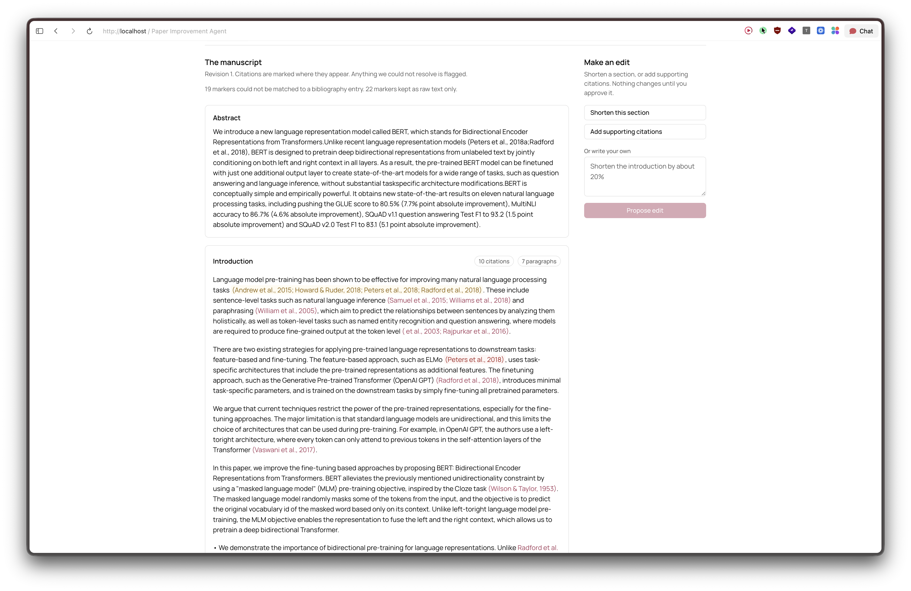 | 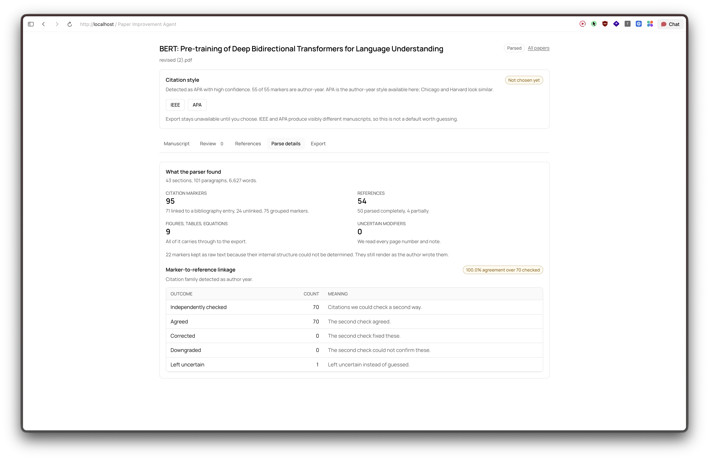 |

| A numeric paper | An author-year paper |
|---|---|
| 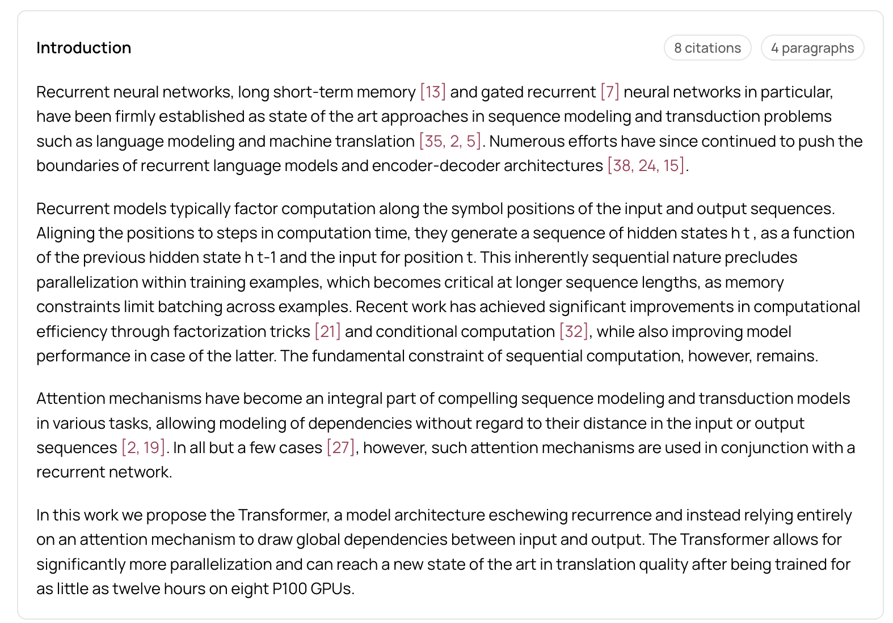 | 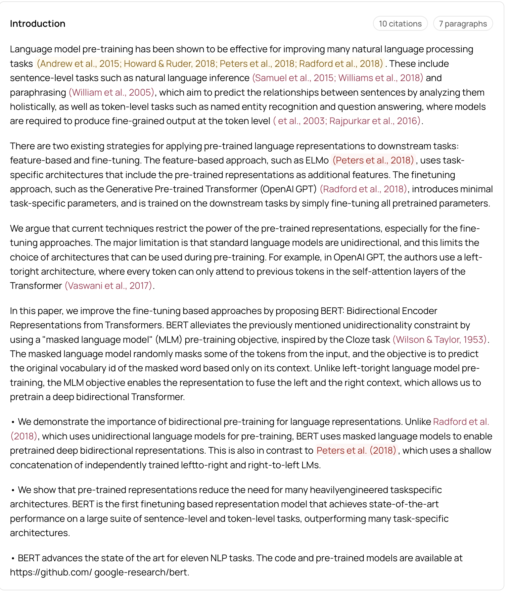 |


**Review.** Two passes: whether each cited work's abstract supports the claim it
is attached to, and which relevant works are missing from the bibliography. Every
suggestion comes from a stored provider response and links back to its record -
the model ranks server-issued IDs and cannot name anything else. Coverage is
reported with denominators, and a degraded search says so.

| Coverage, with denominators | A finding and the abstract span behind it |
|---|---|
| 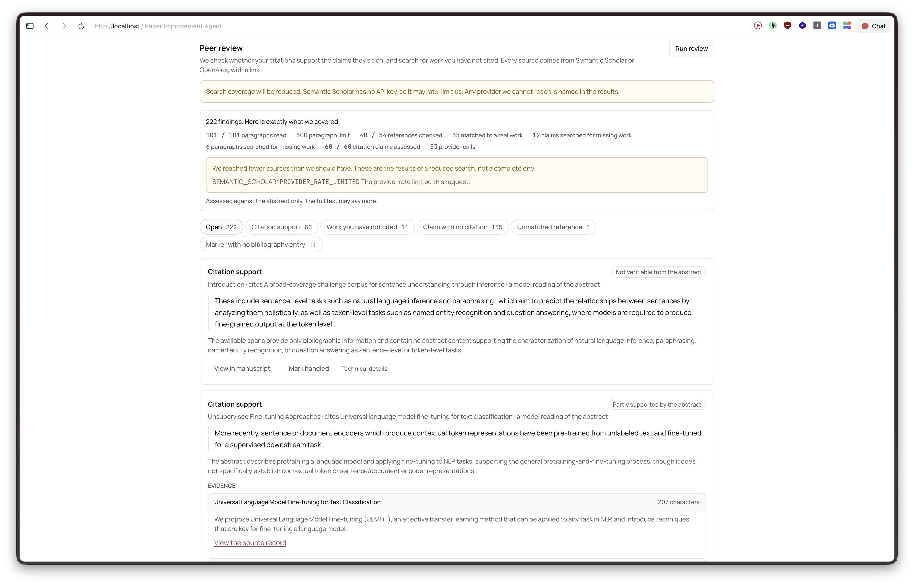 | 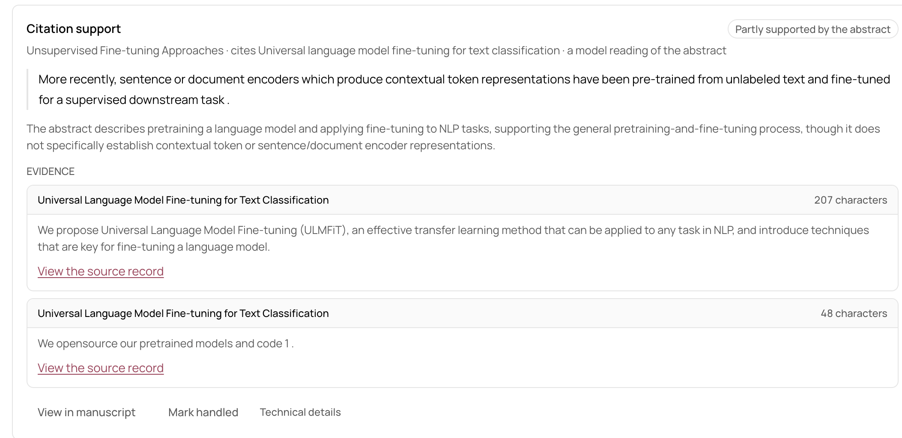 |

| Opening the source to confirm it exists | Work the paper does not cite |
|---|---|
| 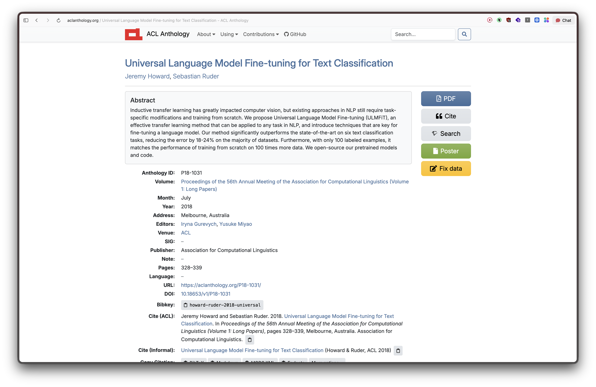 | 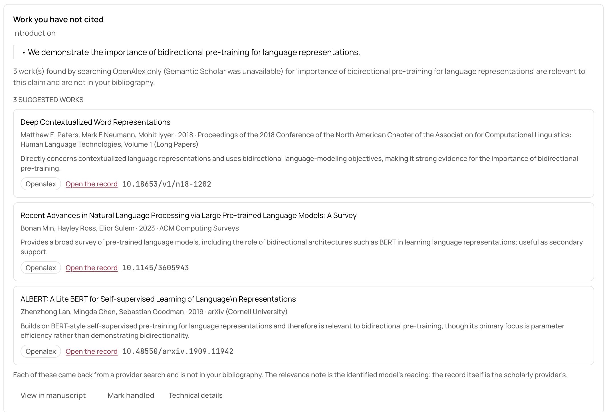 |

| Working through a long review |
|---|
| 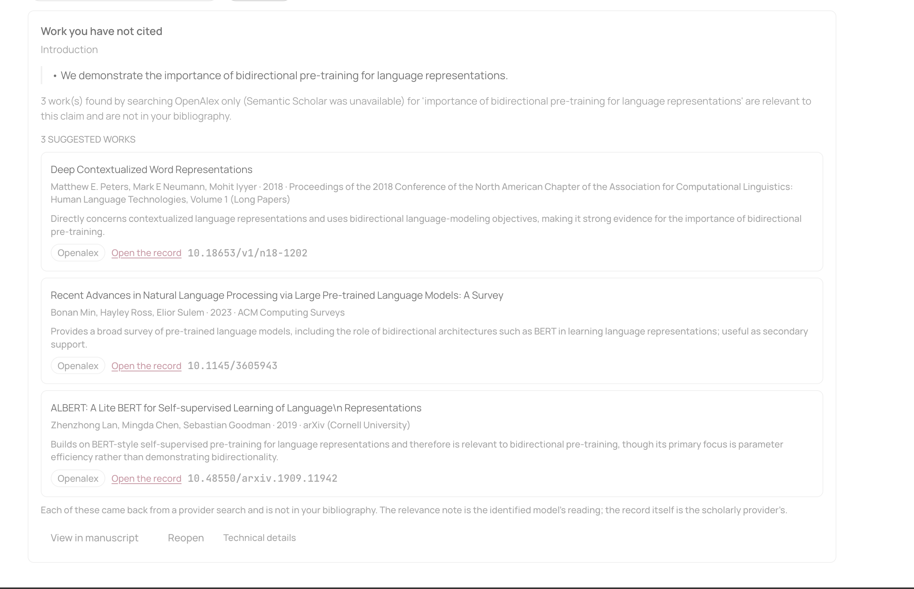 |


**Edit.** Two commands: shorten a section, add supporting citations. A command
produces a proposal, never a change. The before/after diff is computed by
comparing the two documents directly, never by reading the editor's own account
of what it did. Citations reach the model only as opaque tokens. Warnings name a
specific consequence and must be acknowledged; some outcomes block outright.

| A proposal: scope, checks, and diff | A command it will not carry out |
|---|---|
| 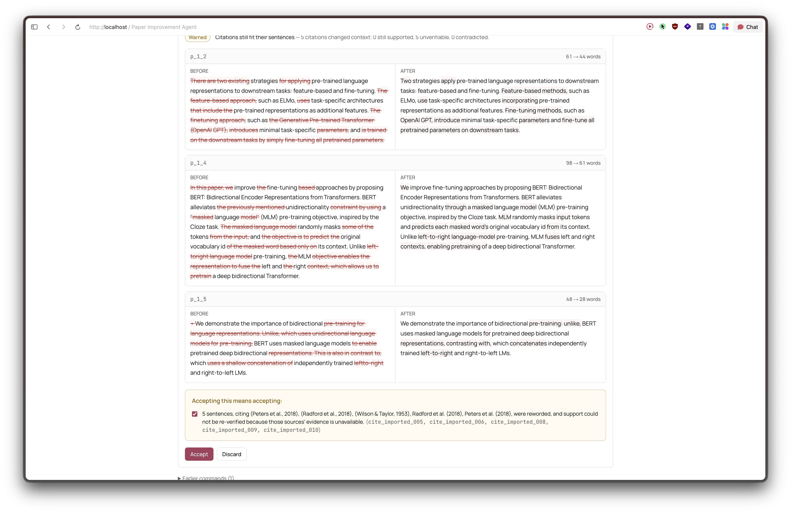 | 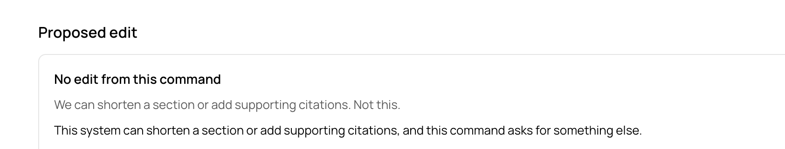 |


**Export.** Pandoc and citeproc render the accepted revision through real CSL
style files. Output is Markdown, LaTeX, PDF, and `references.json`.

| Style, acknowledgements, artifacts | The accepted edit in the exported PDF |
|---|---|
| 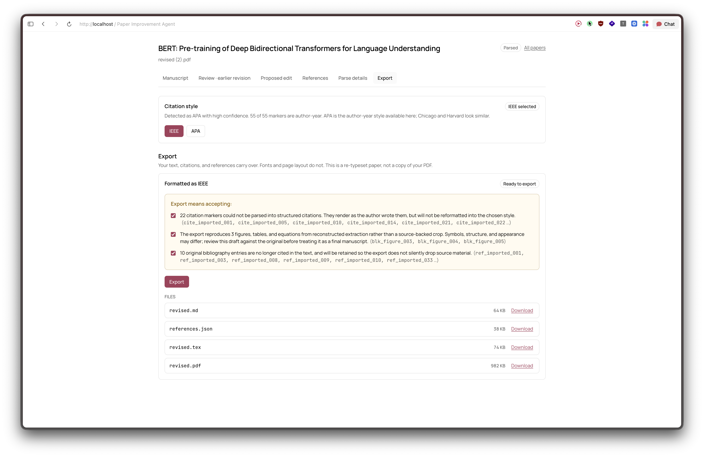 | 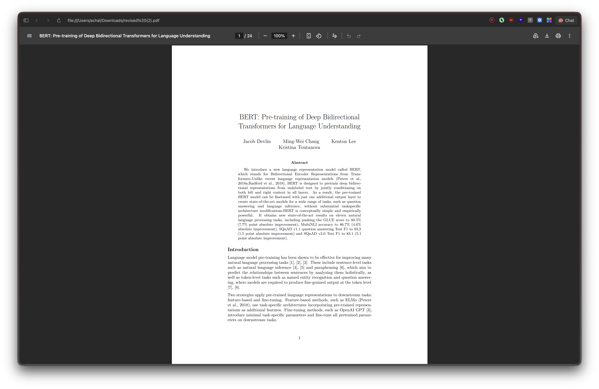 |

## Run locally

Needs Docker Desktop and an LLM API key. A Semantic Scholar key is free and
optional - without one you share an unauthenticated quota and review coverage
drops, which the app reports rather than hides. OpenAlex needs no key.

```bash
cp .env.example .env
# Set LLM_API_KEY and, for full coverage, SEMANTIC_SCHOLAR_API_KEY.
make up
```

- Web app: <http://localhost:3000>
- API docs: <http://localhost:8000/docs>

```bash
make test        # backend and frontend
make test-slow   # real GROBID plus the acceptance end-to-end test
make lint
make typecheck
make live-smoke  # live model and providers; needs keys
```


## System design


- [`docs/citation-parsing.md`](docs/citation-parsing.md) - pipeline stages, the
  intermediate representation, where CSL-JSON fits, styles, and failure handling.
- [`docs/agent-design.md`](docs/agent-design.md) - command routing, grounded
  review, provider calls, candidate revisions, verification, and acceptance.

## Known limitations

- Missing-work search covers a prioritised sample of claims, so a claim with no
  finding may just be one nothing was searched for. The run says which.
- The novelty check on a rewrite is a model judgement, not a proof. The diff you
  approve is the real last gate. `SHORTEN_EXTRACTIVE_ONLY=true` falls back to
  deleting whole sentences instead of rewriting.
  - Missing API key due to request period of 7 days for SEMANTIC_SCHOLAR_API_KEY=... , had submited the form.
- Parsing was tested on numeric and author-year papers. Some names, years, and
  awkward markers still come out uncertain - those are marked, not hidden.
- Style is detected to a family, not an exact style, so you pick within it. Only
  APA and IEEE ship.
- Export is a re-typeset manuscript. Figures, tables, and page layout will not
  exactly match.
- No auth or tenant isolation - it is a single-user.

**To make this production ready:** auth and tenant isolation, long operations
moved onto a durable queue with workers, object storage with a real lifecycle
instead of a local data directory, and full-text retrieval so citation support
is judged on more than abstracts. Then a wider evaluation corpus than three
papers, and per-paragraph acceptance on a multi-paragraph edit.

## AI use

I used AI coding tools for most of the code here was written with them.
What I brought was the design: where the trust boundaries sit, what the system
should refuse to do, and which failures to show rather than smooth over. Architected and iterated over that and make sure everything is covered via tests.


- Recorded GROBID and provider fixtures, so dependency behaviour is checked
  against real captured responses.
